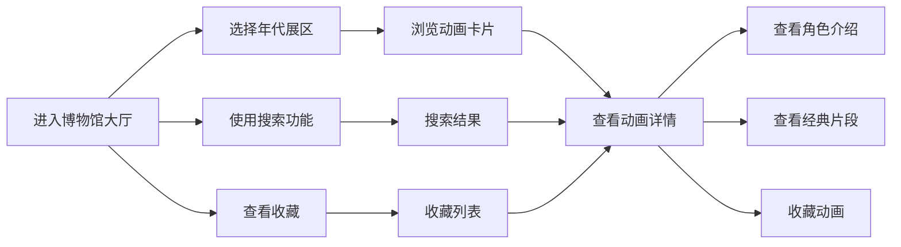

## 1. 产品概述

"动画片博物馆"是一个沉浸式的虚拟博物馆Web应用，带领用户穿越动画历史，重温80年代、90年代、2000年代的经典动画作品。用户可以在虚拟大厅中自由探索各年代展区，欣赏动画海报、了解角色故事、回顾经典片段，并收藏自己喜爱的作品。

- **目标用户**：动画爱好者、怀旧人群、家庭用户
- **核心价值**：打造沉浸式的动画历史探索体验，唤起美好回忆，发现经典动画
- **产品定位**：有温度、有情怀、有趣味的动画文化展示平台

## 2. 核心功能

### 2.1 用户角色

| 角色 | 注册方式 | 核心权限 |
|------|----------|----------|
| 普通用户 | 无需注册（本地存储） | 浏览展区、搜索动画、收藏作品、查看详情 |

### 2.2 功能模块

1. **博物馆大厅**：沉浸式虚拟入口，三个年代展区入口，全局导航和搜索
2. **80年代展区**：80年代经典动画展示，复古像素风格
3. **90年代展区**：90年代黄金动画展示，手绘水彩风格
4. **2000年代展区**：2000年代现代动画展示，赛博朋克风格
5. **动画详情页**：海报展示、角色介绍、经典片段信息
6. **搜索功能**：按名称、年代、角色搜索动画
7. **收藏功能**：本地收藏喜爱的动画，随时查看

### 2.3 页面详情

| 页面名称 | 模块名称 | 功能描述 |
|----------|----------|----------|
| 博物馆大厅 | 主视觉区域 | 3D透视博物馆大厅，霓虹灯效，年代展区入口卡片 |
| 博物馆大厅 | 顶部导航 | Logo、搜索框、收藏按钮、年代快速跳转 |
| 年代展区 | 年代主题Banner | 各年代特色视觉风格，年代简介和代表性作品 |
| 年代展区 | 动画卡片网格 | 动画海报卡片，悬停动效，点击进入详情 |
| 年代展区 | 年代时间轴 | 展示该年代重要动画作品的时间线 |
| 动画详情页 | 海报展示区 | 大尺寸高清海报，动画基本信息 |
| 动画详情页 | 角色介绍 | 主要角色卡片，角色形象和简介 |
| 动画详情页 | 经典片段 | 经典场景描述、台词、分集信息 |
| 搜索结果页 | 搜索过滤 | 按年代、类型筛选搜索结果 |
| 收藏页面 | 收藏列表 | 展示用户收藏的所有动画，支持移除 |

## 3. 核心流程

用户进入网站后，首先看到震撼的博物馆大厅，被霓虹灯效和年代展区吸引。用户可以点击任意年代展区入口进入，浏览该年代的经典动画，点击感兴趣的动画卡片查看详情，了解角色和经典片段。用户可以随时使用顶部搜索框搜索特定动画，或点击收藏按钮保存喜爱的作品。

## 4. 用户界面设计

### 4.1 设计风格

**整体风格**：沉浸式博物馆主题，复古与现代的碰撞，每个年代展区有独特的视觉语言

**色彩方案**：
- 主色调：深邃藏蓝 `#0a0e27` 作为博物馆背景
- 点缀色：
  - 80年代：霓虹粉 `#ff00ff`、像素蓝 `#00ffff`
  - 90年代：暖橙 `#ff6b35`、水彩绿 `#4ecdc4`
  - 2000年代：电光紫 `#9d4edd`、赛博黄 `#ffd60a`
- 中性色：暖白 `#f8f9fa`、深灰 `#2d3748`

**字体选择**：
- 标题字体：'Playfair Display' 或 'Cinzel'（复古优雅，博物馆气质）
- 正文字体：'Noto Sans SC'（清晰易读，中文友好）
- 特殊数字：'Orbitron'（科技感，年代数字）

**按钮风格**：
- 玻璃拟态效果，半透明背景
- 霓虹边框发光效果
- 悬停时有缩放和光晕动画
- 圆角设计，圆润但有分量

**布局风格**：
- 卡片式布局，层次分明
- 大留白，突出内容
- 不规则网格，增加趣味性
- 视差滚动，增强沉浸感

**图标风格**：
- 使用 lucide-react 线性图标
- 动画状态时有微妙的旋转/弹跳效果
- 与整体霓虹风格协调

### 4.2 页面设计概述

| 页面名称 | 模块名称 | UI元素 |
|----------|----------|--------|
| 博物馆大厅 | 主视觉区域 | 深色渐变背景，霓虹灯光晕，大型标题文字，3D透视展区卡片，悬浮动画 |
| 博物馆大厅 | 展区入口卡片 | 各年代特色配色，玻璃拟态边框，悬停上浮效果，年代大数字 |
| 年代展区 | 主题Banner | 全屏宽度，年代特色图案，渐变叠加，大标题动效入场 |
| 年代展区 | 动画卡片网格 | 响应式网格，海报为主，悬停放大，边框发光，收藏按钮 |
| 动画详情页 | 布局 | 左右分栏，左侧海报，右侧信息，滚动渐显动画 |
| 动画详情页 | 角色卡片 | 圆形头像，角色名，简介标签，悬停倾斜效果 |
| 搜索页面 | 搜索框 | 居中大搜索框，输入联想，历史记录 |
| 收藏页面 | 空状态 | 可爱的动画角色插画，引导文案 |

### 4.3 响应式设计

- **桌面优先**：1280px以上为主要设计尺寸
- **平板适配**：768px-1279px，两列或三列网格
- **手机适配**：375px-767px，单列布局，底部导航
- **触摸优化**：加大点击区域（最小44px），移除悬停效果改用长按

### 4.4 视觉动效指导

**入场动画**：
- 页面加载：元素从下方渐入，错落延迟
- 展区卡片：3D翻转入场，依次出现
- 详情页：海报从左侧滑入，信息从右侧滑入

**交互动画**：
- 悬停：卡片上浮5px，阴影增强，边框发光
- 点击：缩放95%后回弹，波纹扩散效果
- 收藏：心形图标弹跳+填充动画
- 搜索：搜索框展开动画，输入时图标跳动

**氛围动效**：
- 背景：微妙的渐变流动，霓虹灯光晕呼吸
- 滚动：视差效果，元素随滚动呈现不同速度
- 光标：自定义光标，霓虹跟随效果

### 4.5 背景与氛围

- **大厅背景**：深邃星空渐变，远处有微弱的星点闪烁
- **80年代**：像素网格背景，扫描线效果，CRT屏幕质感
- **90年代**：水彩纹理叠加，纸张质感，温暖光晕
- **2000年代**：电路纹理，故障艺术效果，数字雨元素
