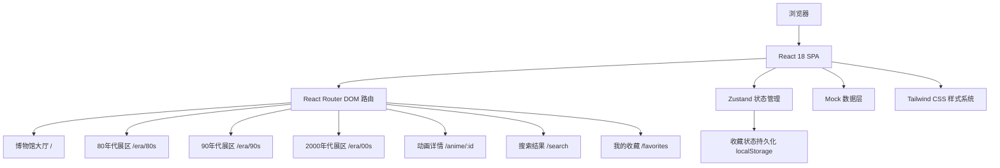
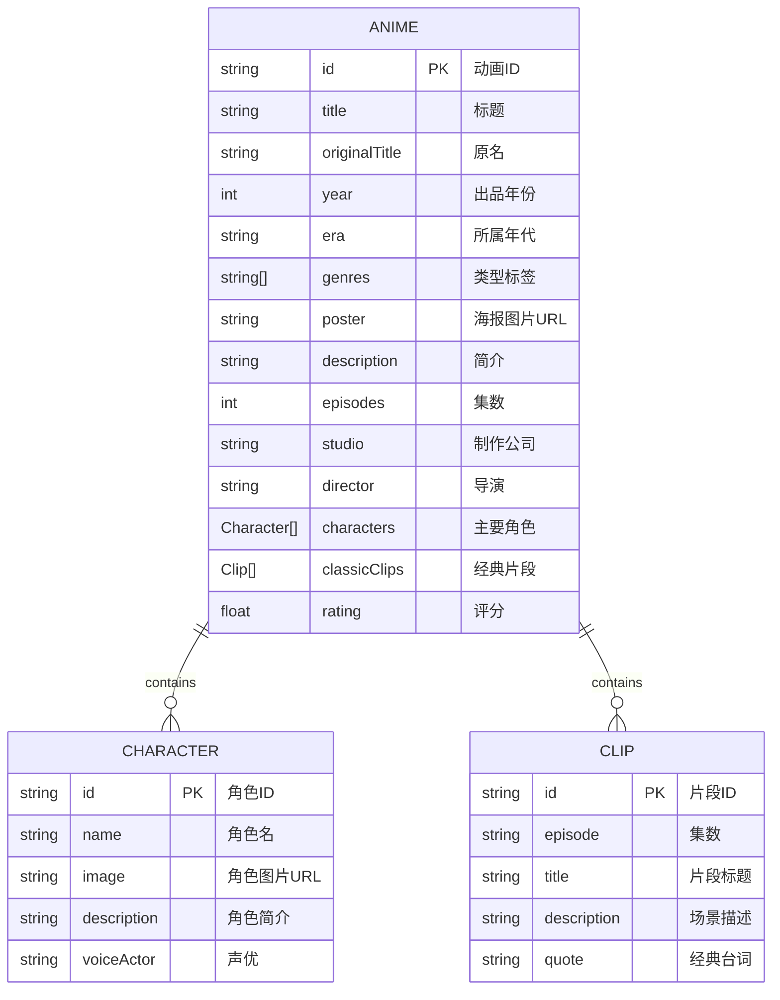

## 1. 架构设计

本项目采用纯前端单页应用架构，使用React 18 + TypeScript + Vite技术栈，数据使用本地Mock数据，状态管理使用zustand，收藏功能通过localStorage持久化存储。



## 2. 技术描述

- **前端框架**：React 18 + TypeScript
- **构建工具**：Vite 5
- **路由管理**：React Router DOM 6
- **状态管理**：zustand 4
- **样式方案**：Tailwind CSS 3 + CSS Variables
- **图标库**：lucide-react
- **数据方案**：本地Mock数据 + TypeScript类型定义
- **持久化**：localStorage存储用户收藏

## 3. 目录结构

```
src/
├── components/          # 通用组件
│   ├── Navbar.tsx       # 顶部导航
│   ├── AnimeCard.tsx    # 动画卡片
│   ├── CharacterCard.tsx # 角色卡片
│   ├── SearchBar.tsx    # 搜索框
│   ├── EraCard.tsx      # 年代展区卡片
│   └── FavoritesButton.tsx # 收藏按钮
├── pages/               # 页面组件
│   ├── Hall.tsx         # 博物馆大厅
│   ├── EraPage.tsx      # 年代展区页面
│   ├── AnimeDetail.tsx  # 动画详情页
│   ├── SearchResult.tsx # 搜索结果页
│   └── Favorites.tsx    # 收藏页面
├── store/               # 状态管理
│   └── useFavoritesStore.ts # 收藏状态
├── data/                # Mock数据
│   └── animes.ts        # 动画数据
├── types/               # 类型定义
│   └── index.ts         # 全局类型
├── hooks/               # 自定义Hooks
│   └── useSearch.ts     # 搜索逻辑
├── utils/               # 工具函数
│   └── animation.ts     # 动画相关工具
├── App.tsx              # 应用入口
├── main.tsx             # React入口
└── index.css            # 全局样式
```

## 4. 路由定义

| 路由 | 页面 | 说明 |
|------|------|------|
| `/` | 博物馆大厅 | 主入口，展示三个年代展区 |
| `/era/80s` | 80年代展区 | 80年代经典动画列表 |
| `/era/90s` | 90年代展区 | 90年代经典动画列表 |
| `/era/00s` | 2000年代展区 | 2000年代经典动画列表 |
| `/anime/:id` | 动画详情 | 展示动画详细信息 |
| `/search` | 搜索结果 | 搜索结果展示页 |
| `/favorites` | 我的收藏 | 用户收藏的动画列表 |

## 5. 数据模型

### 5.1 数据模型定义



### 5.2 TypeScript类型定义

```typescript
export interface Character {
  id: string;
  name: string;
  image: string;
  description: string;
  voiceActor: string;
}

export interface ClassicClip {
  id: string;
  episode: string;
  title: string;
  description: string;
  quote: string;
}

export interface Anime {
  id: string;
  title: string;
  originalTitle: string;
  year: number;
  era: '80s' | '90s' | '00s';
  genres: string[];
  poster: string;
  description: string;
  episodes: number;
  studio: string;
  director: string;
  characters: Character[];
  classicClips: ClassicClip[];
  rating: number;
}

export type EraType = '80s' | '90s' | '00s';

export interface EraInfo {
  id: EraType;
  name: string;
  description: string;
  color: string;
  bgGradient: string;
}
```

## 6. 状态管理设计

### 收藏状态 Store

```typescript
interface FavoritesState {
  favorites: string[]; // 收藏的动画ID列表
  addFavorite: (id: string) => void;
  removeFavorite: (id: string) => void;
  isFavorite: (id: string) => boolean;
  toggleFavorite: (id: string) => void;
}
```

- 初始化时从localStorage读取收藏列表
- 每次变更自动同步到localStorage
- 提供快捷方法判断是否已收藏

## 7. 核心组件设计

### 7.1 AnimeCard 组件

| 属性 | 类型 | 说明 |
|------|------|------|
| anime | Anime | 动画数据 |
| showFavorite? | boolean | 是否显示收藏按钮 |
| variant? | 'default' \| 'compact' | 卡片样式变体 |

### 7.2 EraCard 组件

| 属性 | 类型 | 说明 |
|------|------|------|
| era | EraInfo | 年代信息 |
| count | number | 该年代动画数量 |
| onClick | () => void | 点击事件 |

### 7.3 CharacterCard 组件

| 属性 | 类型 | 说明 |
|------|------|------|
| character | Character | 角色数据 |

## 8. 性能优化

- **图片懒加载**：使用React.lazy和Intersection Observer
- **列表虚拟化**：长列表使用虚拟滚动
- **组件拆分**：细粒度组件，避免不必要重渲染
- **防抖搜索**：搜索输入添加300ms防抖
- **本地缓存**：收藏数据本地存储，避免请求
- **CSS优化**：使用Tailwind JIT，精简CSS体积

## 9. 浏览器兼容性

- 支持现代浏览器：Chrome 90+, Firefox 88+, Safari 14+
- 使用CSS变量和Grid布局
- 提供必要的降级方案
- 不支持IE浏览器
