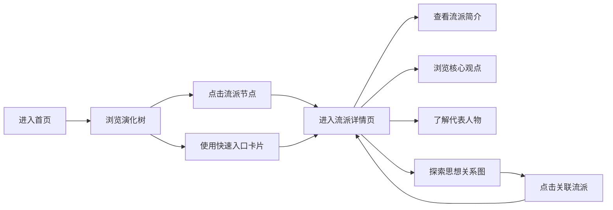

## 1. 产品概述

中国哲学学习与探索平台，通过可视化演化树的形式，系统展现从先秦诸子百家到宋明理学的中国哲学思想发展脉络。平台旨在为哲学爱好者、学生和研究者提供沉浸式的中国哲学探索体验，打破传统百科的枯燥呈现方式，以交互式可视化让思想流派的传承与演变变得直观可感。

- 核心价值：将抽象的哲学思想脉络可视化，让用户在探索中理解中国哲学的博大精深
- 目标用户：哲学爱好者、学生、研究者、文化从业者
- 差异化：交互式演化树、思想关系图谱、沉浸式学习体验

## 2. 核心功能

### 2.1 用户角色

| 角色 | 注册方式 | 核心权限 |
|------|----------|----------|
| 访客用户 | 无需注册 | 浏览演化树、查看流派详情、探索思想关系图 |

### 2.2 功能模块

1. **首页**：英雄区域、导航栏、演化树主视图、流派快速入口
2. **流派详情页**：流派简介、核心观点、代表人物、经典著作、思想关系图
3. **思想演化树**：交互式SVG树形结构、时间轴、流派节点、传承关系连线
4. **思想关系图**：力导向图展示流派间相互影响、引用关系、思想交锋

### 2.3 页面详情

| 页面名称 | 模块名称 | 功能描述 |
|----------|----------|----------|
| 首页 | 英雄区域 | 大气的中国风标题动画，平台介绍，进入探索按钮 |
| 首页 | 演化树主视图 | 交互式树形结构，展示从先秦到宋明的思想流派发展脉络，支持缩放、平移 |
| 首页 | 流派快速入口 | 儒、道、法、墨、名、阴阳家等主要流派卡片，点击进入详情 |
| 流派详情页 | 流派概览 | 流派简介、发源时期、核心主张、历史影响 |
| 流派详情页 | 核心观点 | 以卡片形式展示流派的核心思想观点，配原文引用 |
| 流派详情页 | 代表人物 | 人物头像、生平简介、主要贡献、名言警句 |
| 流派详情页 | 思想关系图 | 可视化展示该流派与其他流派的相互影响、传承、批判关系 |
| 流派详情页 | 时间轴 | 展示流派发展的重要时间节点和事件 |

## 3. 核心流程

用户进入首页，首先看到大气的英雄区域和演化树概览。用户可以：
1. 直接在演化树上点击感兴趣的流派节点，进入详情页
2. 通过下方的流派快速入口卡片进入详情页
3. 在演化树上缩放、平移，探索不同时期的思想流派
4. 在详情页中查看思想关系图，了解流派间的相互影响
5. 通过导航在不同流派间切换探索

## 4. 用户界面设计

### 4.1 设计风格

**整体气质**：典雅沉静的东方美学，融入水墨、宣纸、竹简等中国传统元素，兼具现代设计的简洁与留白。

- **主色调**：
  - 水墨黑 `#1a1a1a`（文字标题）
  - 宣纸米白 `#f5f0e6`（背景）
  - 朱砂红 `#c23a3a`（儒家主题，强调色）
  - 青花蓝 `#2c5f8c`（道家主题）
  - 青铜绿 `#4a7c59`（墨家主题）
  - 石黄 `#d4a017`（法家主题）
  - 松烟墨 `#2d2d2d`（名家主题）
  - 紫檀紫 `#6b4e71`（阴阳家主题）

- **字体**：
  - 标题：使用具有书法韵味的衬线字体，如「Noto Serif SC」或「Source Han Serif」
  - 正文：清晰易读的无衬线字体，如「Noto Sans SC」
  - 引用：使用斜体衬线字体，营造古籍感

- **按钮与交互元素**：
  - 圆角设计（8px-12px），体现温润的东方美学
  - 悬停时加入水墨晕染般的渐变效果
  - 点击时的涟漪反馈，如投石入水

- **布局风格**：
  - 非对称布局，打破网格的拘束感
  - 大量留白，营造呼吸空间
  - 层次感分明的卡片和阴影
  - 装饰性元素：云纹、水纹、印章等传统图案

- **图标风格**：线性图标，融入毛笔笔触元素，使用 lucide-react 图标库并自定义样式

### 4.2 页面设计概述

| 页面名称 | 模块名称 | UI元素 |
|----------|----------|----------|
| 首页 | 英雄区域 | 全屏背景（水墨山水渐变），大标题书法字体渐入动画，副标题淡入，探索按钮脉冲动效 |
| 首页 | 演化树主视图 | 居中SVG树形结构，节点随时间轴分布，曲线连接线带流动光效，节点悬停放大发光 |
| 首页 | 快速入口卡片 | 横向排列的彩色卡片，每个流派对应主题色，悬停时卡片上浮并显示简介预览 |
| 流派详情页 | 概览区域 | 大幅背景（相关主题色渐变），流派名称书法大字，简介文字竖排排版可选 |
| 流派详情页 | 核心观点 | 卡片式布局，每个观点配古籍原文引用，引用块使用竹简边框样式 |
| 流派详情页 | 代表人物 | 圆形人物头像（水墨风格），悬停显示名言气泡，人物卡片横向排列 |
| 流派详情页 | 思想关系图 | 力导向SVG图谱，节点颜色区分流派，线条粗细表示关系强度，点击节点高亮 |
| 流派详情页 | 时间轴 | 垂直时间轴，节点使用印章样式，事件卡片从左右交替出现 |

### 4.3 响应式设计

- **设计原则**：Desktop-first，移动端自适应
- **桌面端（>1200px）**：完整的演化树展示，三栏布局详情页
- **平板端（768px-1200px）**：演化树支持触摸缩放，两栏布局详情页
- **移动端（<768px）**：演化树转为竖向时间线，单栏流式布局，触摸优化的点击区域（≥44px）

### 4.4 动画与交互细节

- **页面载入**：
  - 背景山水晕染动画（2s）
  - 标题逐字显现（0.8s，每字延迟0.1s）
  - 演化树节点从根部向外依次浮现
  - 连接线从无到有生长动画

- **悬停效果**：
  - 节点放大1.2倍，外发光效果
  - 连接线亮度提升，流动光点加速
  - 卡片上浮8px，阴影加深
  - 按钮背景色渐变，文字轻微上浮

- **点击反馈**：
  - 节点中心涟漪扩散
  - 页面切换时的淡入淡出过渡（0.4s）
  - 详情页内容从下往上滑入

- **滚动动效**：
  - 元素随滚动渐显（Intersection Observer）
  - 视差滚动的背景层
  - 滚动时导航栏毛玻璃效果增强

### 4.5 特殊视觉效果

- **水墨晕染背景**：使用CSS渐变和噪点纹理模拟宣纸质感
- **印章装饰**：重要标题旁添加红色印章元素（"哲学"、"传承"等）
- **竹简引用框**：经典引用使用竹简样式的边框和背景
- **流动光效**：演化树连接线使用SVG动画模拟思想的流动
- **呼吸动效**：主要节点有轻微的呼吸缩放效果，象征思想的生命力
