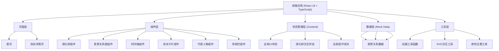

## 1. 架构设计



## 2. 技术描述

- **前端框架**：React 18 + TypeScript
- **构建工具**：Vite 5
- **样式方案**：TailwindCSS 3 + 自定义CSS变量
- **路由管理**：React Router DOM 6
- **状态管理**：Zustand
- **图标库**：Lucide React
- **可视化**：原生 SVG + 自定义力导向算法（无需引入d3等重型库）
- **动画**：CSS Keyframes + Framer Motion（用于复杂动画）
- **后端**：无后端，纯前端应用，使用Mock数据
- **数据库**：无需数据库，所有数据内置为TypeScript常量

## 3. 路由定义

| 路由 | 页面 | 描述 |
|------|------|------|
| `/` | 首页 | 英雄区域 + 演化树主视图 + 流派快速入口 |
| `/school/:id` | 流派详情页 | 流派简介 + 核心观点 + 代表人物 + 思想关系图 + 时间轴 |

## 4. 数据模型

### 4.1 类型定义

```typescript
interface School {
  id: string;
  name: string;
  englishName: string;
  period: string;
  era: 'pre-qin' | 'han' | 'wei-jin' | 'tang' | 'song-ming';
  color: string;
  icon: string;
  briefIntro: string;
  fullIntro: string;
  coreBeliefs: CoreBelief[];
  representatives: Person[];
  classics: Classic[];
  timeline: TimelineEvent[];
  relations: Relation[];
  position: { x: number; y: number };
}

interface CoreBelief {
  id: string;
  title: string;
  description: string;
  quote: string;
  source: string;
}

interface Person {
  id: string;
  name: string;
  styleName?: string;
  years: string;
  avatar: string;
  briefIntro: string;
  famousQuotes: string[];
  majorWorks: string[];
  schoolId: string;
}

interface Classic {
  id: string;
  title: string;
  author: string;
  period: string;
  description: string;
}

interface TimelineEvent {
  id: string;
  year: string;
  title: string;
  description: string;
  type: 'birth' | 'work' | 'event' | 'death';
}

interface Relation {
  id: string;
  fromSchoolId: string;
  toSchoolId: string;
  type: 'inherit' | 'influence' | 'criticize' | 'complement';
  description: string;
  strength: number;
}

interface TreeNode {
  id: string;
  school: School;
  children: TreeNode[];
  parentId?: string;
}
```

### 4.2 流派数据结构

包含以下主要流派的完整数据：
1. 儒家（ Confucianism ）- 朱砂红 `#c23a3a`
2. 道家（ Daoism ）- 青花蓝 `#2c5f8c`
3. 法家（ Legalism ）- 石黄 `#d4a017`
4. 墨家（ Mohism ）- 青铜绿 `#4a7c59`
5. 名家（ School of Names ）- 松烟墨 `#2d2d2d`
6. 阴阳家（ School of Yin-Yang ）- 紫檀紫 `#6b4e71`
7. 兵家（ School of Military ）- 玄铁灰 `#4a4a4a`
8. 纵横家（ School of Diplomacy ）- 琥珀金 `#b8860b`
9. 杂家（ Syncretism ）- 秋香绿 `#8a9a5b`
10. 宋明理学（ Neo-Confucianism ）- 朱砂红渐变

## 5. 核心组件设计

### 5.1 EvolutionTree 演化树组件

- **Props**: `schools: School[]`, `onNodeClick: (id: string) => void`
- **功能**:
  - SVG渲染树形结构，节点按时代分布
  - 支持鼠标滚轮缩放、拖拽平移
  - 节点呼吸动效、悬停放大发光
  - 连接线流动光效动画
  - 点击节点跳转详情页

### 5.2 RelationGraph 思想关系图组件

- **Props**: `school: School`, `allSchools: School[]`, `onSchoolClick: (id: string) => void`
- **功能**:
  - 力导向布局算法实现节点自动排布
  - 不同颜色区分流派，线条粗细表示关系强度
  - 支持拖拽节点调整位置
  - 悬停显示关系描述
  - 点击节点切换到对应流派

### 5.3 SchoolCard 流派卡片组件

- **Props**: `school: School`, `onClick: () => void`
- **功能**:
  - 展示流派名称、图标、简介
  - 悬停上浮效果
  - 主题色背景渐变

### 5.4 PersonCard 代表人物卡片组件

- **Props**: `person: Person`
- **功能**:
  - 圆形头像（使用AI生成图像URL）
  - 悬停显示名言气泡
  - 点击展开详细信息

### 5.5 Timeline 时间轴组件

- **Props**: `events: TimelineEvent[]`
- **功能**:
  - 垂直时间轴布局
  - 印章样式的时间节点
  - 事件卡片左右交替出现
  - 滚动渐入动画

## 6. 目录结构

```
/
├── src/
│   ├── components/
│   │   ├── EvolutionTree.tsx
│   │   ├── RelationGraph.tsx
│   │   ├── SchoolCard.tsx
│   │   ├── PersonCard.tsx
│   │   ├── Timeline.tsx
│   │   ├── Navigation.tsx
│   │   ├── HeroSection.tsx
│   │   ├── CoreBeliefCard.tsx
│   │   ├── ClassicCard.tsx
│   │   ├── SealStamp.tsx
│   │   └── AnimatedTransition.tsx
│   ├── pages/
│   │   ├── Home.tsx
│   │   └── SchoolDetail.tsx
│   ├── data/
│   │   ├── schools.ts
│   │   ├── persons.ts
│   │   └── relations.ts
│   ├── store/
│   │   └── useStore.ts
│   ├── hooks/
│   │   ├── usePanZoom.ts
│   │   ├── useForceLayout.ts
│   │   └── useScrollReveal.ts
│   ├── utils/
│   │   ├── colors.ts
│   │   ├── animations.ts
│   │   └── svg.ts
│   ├── types/
│   │   └── index.ts
│   ├── App.tsx
│   ├── main.tsx
│   └── index.css
├── public/
│   └── favicon.ico
├── package.json
├── tsconfig.json
├── vite.config.ts
├── tailwind.config.js
└── postcss.config.js
```

## 7. 状态管理设计

使用Zustand管理全局状态：

```typescript
interface AppState {
  selectedSchoolId: string | null;
  setSelectedSchoolId: (id: string | null) => void;
  treeZoom: number;
  setTreeZoom: (zoom: number) => void;
  treePan: { x: number; y: number };
  setTreePan: (pan: { x: number; y: number }) => void;
  isMenuOpen: boolean;
  toggleMenu: () => void;
}
```

## 8. 动画策略

- **CSS变量动画**：用于呼吸效果、渐变过渡等简单动画
- **Framer Motion**：用于页面切换、列表项动画等复杂动画
- **SVG SMIL动画**：用于连接线流动光效
- **requestAnimationFrame**：用于力导向图的实时更新
- **Intersection Observer**：用于滚动触发的元素渐显

## 9. 性能优化

- 演化树使用SVG的`viewBox`属性实现高效缩放
- 力导向图使用requestAnimationFrame批量更新
- 图片使用懒加载
- 组件使用React.memo避免不必要重渲染
- 复杂计算使用useMemo和useCallback缓存

## 10. 无障碍设计

- 使用语义化HTML标签
- 添加ARIA属性
- 键盘导航支持
- 足够的颜色对比度
- 文字大小可缩放
